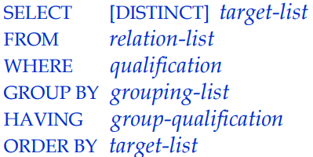
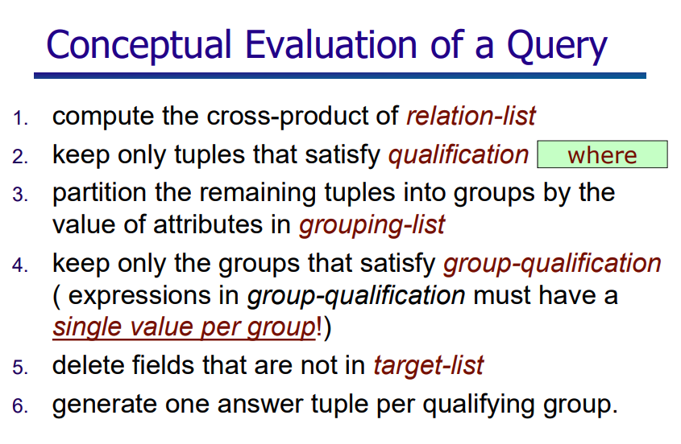
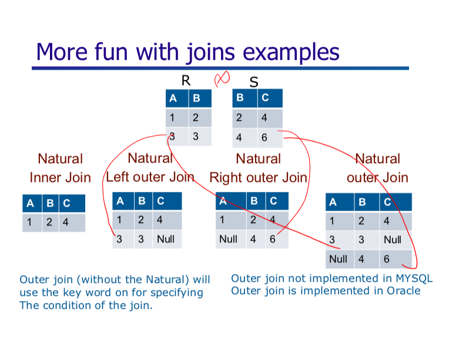

# SQL Salon


## Summary of topics

1. Data Definition Language
1. Basic Structure
1. Set Operations
1. Aggregate Functions
1. Null Values
1. Nested Subqueries


*Likely, we won't cover these topics...*

1. Modification of the Database
1. Views
1. Integrity Constraints


## Code Examples

We will be using http://sqlfiddle.com to do all exercises, with sample SQL files`all.sql` and others in the repo


## Overview

### 1. Data Definition Language

- create table
- domain types
- timestamps in SQL

See sample SQL files for examples.

#### More exercises

- SQL Lesson 16: Creating tables	https://sqlbolt.com/lesson/creating_tables
	 SQL Lesson 17: Altering tables	https://sqlbolt.com/lesson/altering_tables
- SQL Lesson 18: Dropping tables https://sqlbolt.com/lesson/dropping_tables
	 SQL Lesson 13: Inserting rows	https://sqlbolt.com/lesson/inserting_rows
	 SQL Lesson 14: Updating rows	https://sqlbolt.com/lesson/updating_rows
	 SQL Lesson 15: Deleting rows	https://sqlbolt.com/lesson/deleting_rows


### 2. Basic Structure

- select-from-where


- **Movie Examples** from `movie.sql`
  - WHERE clause: can use many different kinds of pattern matching:
    - attribute names of the relation(s) used in the FROM.
    - comparison operators: =, <>, <, >, <=, >=
    - apply arithmetic operations: rating*2
    - operations on strings (e.g., “||” for concatenation).
    - Lexicographic order on strings.
    - Pattern matching: s LIKE p
    - Special stuff for comparing dates and times.
  - Selection & projection
  - Joins
  - `DISTINCT`
  - Renaming attributes
- **New Students Example** from `students.sql`
  - String comparison
  - Ordering of tuples
  - Sorting

#### More exercises

SQL Lesson 1: SELECT queries 101	https://sqlbolt.com/lesson/select_queries_introduction

SQL Lesson 2: Queries with constraints (Pt. 1)	https://sqlbolt.com/lesson/select_queries_with_constraints
SQL Lesson 3: Queries with constraints (Pt. 2)	https://sqlbolt.com/lesson/select_queries_with_constraints_pt_2
SQL Lesson 4: Filtering and sorting Query results	https://sqlbolt.com/lesson/filtering_sorting_query_results

SQL Review: Simple SELECT Queries	https://sqlbolt.com/lesson/select_queries_review


### 3. Set Operations

- union, intersect, except
- SQL exercises using sample files


#### More exercises

Unions, Intersections & Exceptions https://sqlbolt.com/topic/set_operations


### 4. Nested Subqueries

- `SELECT`, `FROM`, `WHERE`, `HAVING` can itself contain SQL query - but `WHERE` is most common
- **MovieStars Example**
- `EXISTS`, `NOT EXISTS` operations
- try oldest, youngest, etc calculations using nested subqueries first
- *skip division query*


#### Exercises

SQL Topic: Subqueries https://sqlbolt.com/topic/subqueries


### 5. Aggregate Functions

- Avg, Min, Max, Sum, Count
- groupings of your own (**Student Example**)
- `HAVING`







##### More exercises

- SQL Lesson 10: Queries with aggregates (Pt. 1)	https://sqlbolt.com/lesson/select_queries_with_aggregates
- SQL Lesson 11: Queries with aggregates (Pt. 2)	https://sqlbolt.com/lesson/select_queries_with_aggregates_pt_2


#### Overall summary:


### 6. Joins



- SQL Lesson 6: Multi-table queries with JOINs	https://sqlbolt.com/lesson/select_queries_with_joins
	 SQL Lesson 7: OUTER JOINs	https://sqlbolt.com/lesson/select_queries_with_outer_joins


### 5. Null Values

- SQL Lesson 8: A short note on NULLs	https://sqlbolt.com/lesson/select_queries_with_nulls


### Challenge Problems!

Use `prof.sql` for these problems.

Consider the following collection of relation schemes:

```
professor(profname, deptname)
department(deptname, building)
committee(commname, profname)

```

1. Find all the professors who are in any one of the committees that professor Piper is in.


2. Find all the professors who are in at least all those committees that professor Piper is in.


3. Find all the professors who have not offices in any of  those buildings that Professor Piper has offices in.

## Interactive Tutorials

- SQLZoo http://sqlzoo.net/wiki/SQL_Tutorial

- SQL Teaching https://www.sqlteaching.com

- PostgreSQL Exercises https://pgexercises.com/

- HackerRank problems https://www.hackerrank.com/domains/sql/advanced-join

- SQL for data analysis https://community.modeanalytics.com/sql/tutorial/introduction-to-sql/

- Khan Academy https://www.khanacademy.org/computing/hour-of-code/hour-of-sql/p/creating-a-table-and-inserting-data

- Advanced SQL https://news.ycombinator.com/item?id=13417326


